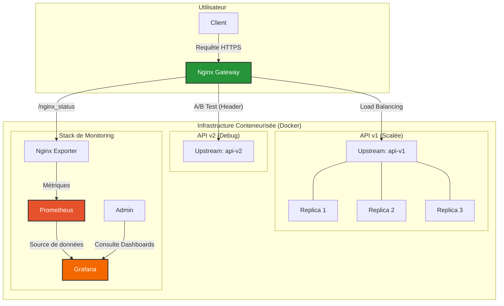

# Implémentation basique d'un stack conteneurisé d'une API ML

## Description

Ce repo contient une version basique mais fonctionnelle d'un stack d'inférence de machine learning avec :
* un reverse proxy Nginx pour router et équilibrer les demandes entrentes,
* une sécurisation HTTPS au niveau du proxy
* une authentification basique par utilisateur et mot de passe (.htpasswd)
* une protection de type "rate limiting"
* 2 versions de l'api : une version de prod, et une version de debuggage
* un routage de type A/B entre les deux vesions suivant la présence d'un en-tête http

Le stack est piloté par une simple orchestration docjer compose avec :
* 3 replicas de la version prod de l'api
* 1 conteneur pour la version debug
* le conteneur nginx
* 3 conteneurs pour le stack de monitoring prometheuse-grafana

## Prérequis
* `Docker`, `docker compose` et `makefile tool` pour l'execution
* un environnement python avec `uv` (recommandé)

## Usage

* Le makefile contient toutes les commandes de pilotage:
    * `make run start-project` pour build et lancer le stack
    * `make run stop-project` pour démonter le stack
    * `make run logs-project` pour voir les logs du stack
    * `make run test-project` pour tester l'ensemble des fonctionnalités
    * `make run test-api` pour un simple test sur l'api principale

* l'ui de monitoring est disponible sur : http://localhost:3000

* l'utilisateur par défaut pour accès à l'api et à l'UI de monitoring Grafana est : `admin:admin`

* Pour un usage hors lab, il faudra prévoir de prendre un certificat auprès d'une CA et des mettres dans `deployments/nginx/certs`
(ou d'utiliser un conteneur certbot + let'sencrypt par exemple)

## Schéma fonctionnel

Le schéma suivant illustre l'architecture complète du stack.



## Structure du Projet

Voici l'arborescence de fichiers du projet :

```sh
. 
├── Makefile
├── README.md
├── README_student.md
├── data
│   └── tweet_emotions.csv
├── deployments
│   ├── nginx
│   │   ├── Dockerfile
│   │   ├── certs
│   │   │   ├── nginx.crt
│   │   │   └── nginx.key
│   │   └── nginx.conf
│   └── prometheus
│       └── prometheus.yml
├── docker-compose.yml
├── model
│   └── model.joblib
├── src
│   ├── api
│   │   ├── requirements.txt
│   │   ├── v1
│   │   │   ├── Dockerfile
│   │   │   └── main.py
│   │   └── v2
│   │       ├── Dockerfile
│   │       └── main.py
│   └── gen_model.py
└── tests
    └── run_tests.sh
```